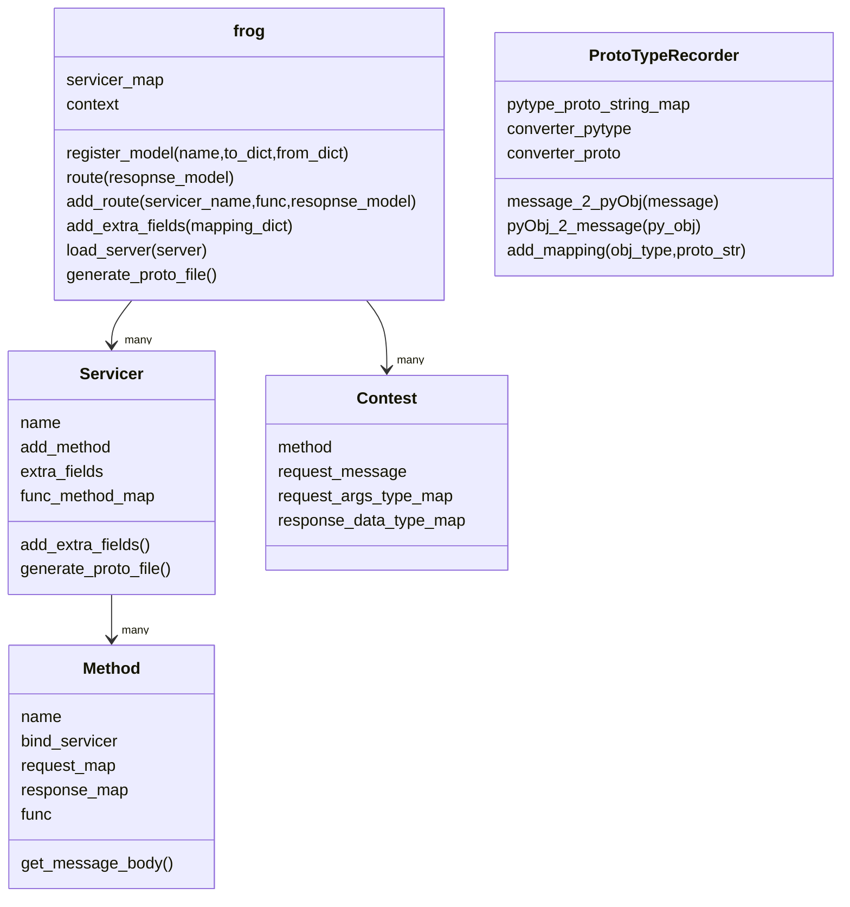

# grpc-frog

grpc_helper

* 望做成D端或者C端定好模型，一键生成协议和另外一端。
* 希望用户不接触proto协议，只定义模型(pydantic)和接口。

## 概念

* proto: 生成的proto文件
* py_type: python的数据类型 class
* CMessage: rpc Server 传输的数据类型
* CMessage 驼峰表示声明的Class 下划线命名表示是系统自动生成的class

> 生成requirements.txt    
> `pipreqs . --encoding utf8 --pypi-server https://pypi.douban.com/simple/`

## 结构图



## Examples

* 服务端命令

```bash
cd example
python gen_hello_c.py
python hello_d/run.py
```

* 客户端命令

```bash
cd example
python hello_c/call.py
```

---

## Features

* TODO
